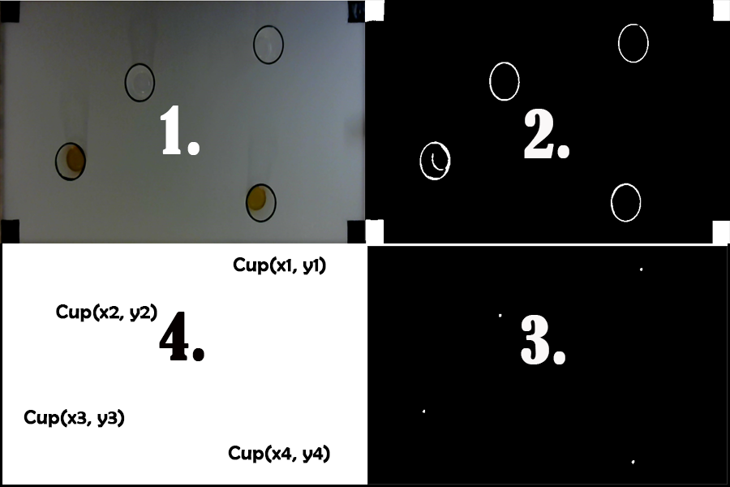

## Introduction
This project digitilizes the game of beer pong with the use a camera, projector, semi-transparent table and image processing. The system tracks the position of beer cups, keeps track of the game's lifecycle, the score, and enhances the experiances with new features and animations.

## Product
Rough visualization of the image processing pipeline.

